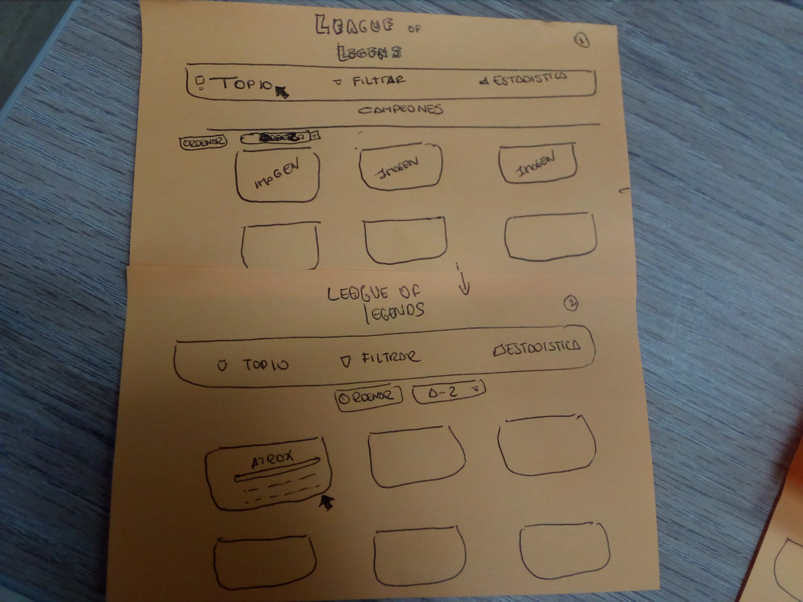
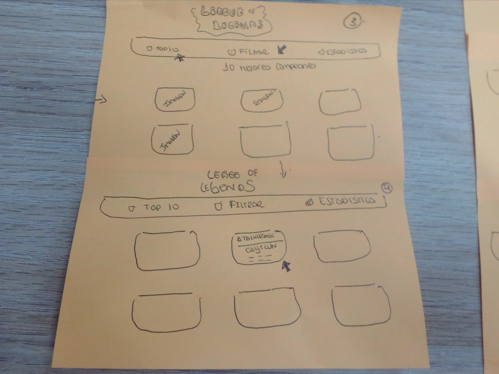
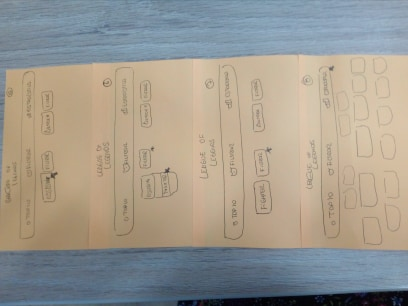
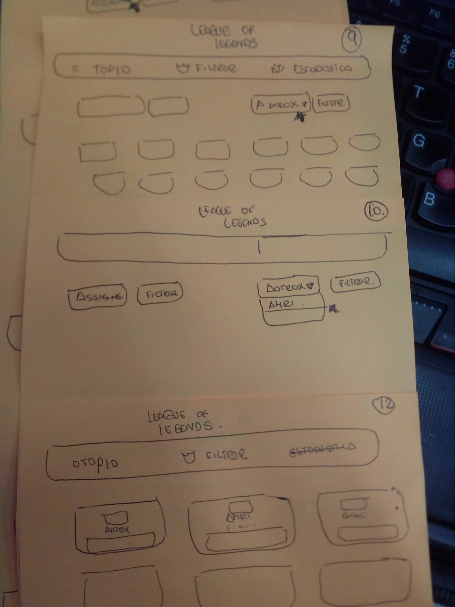
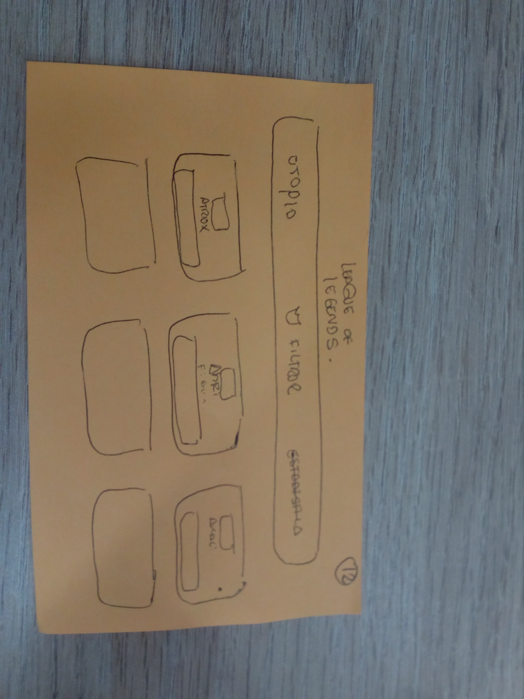
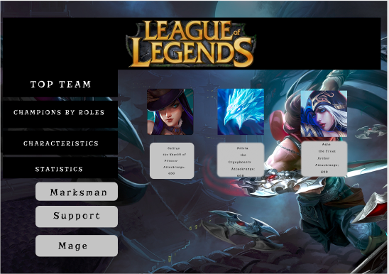
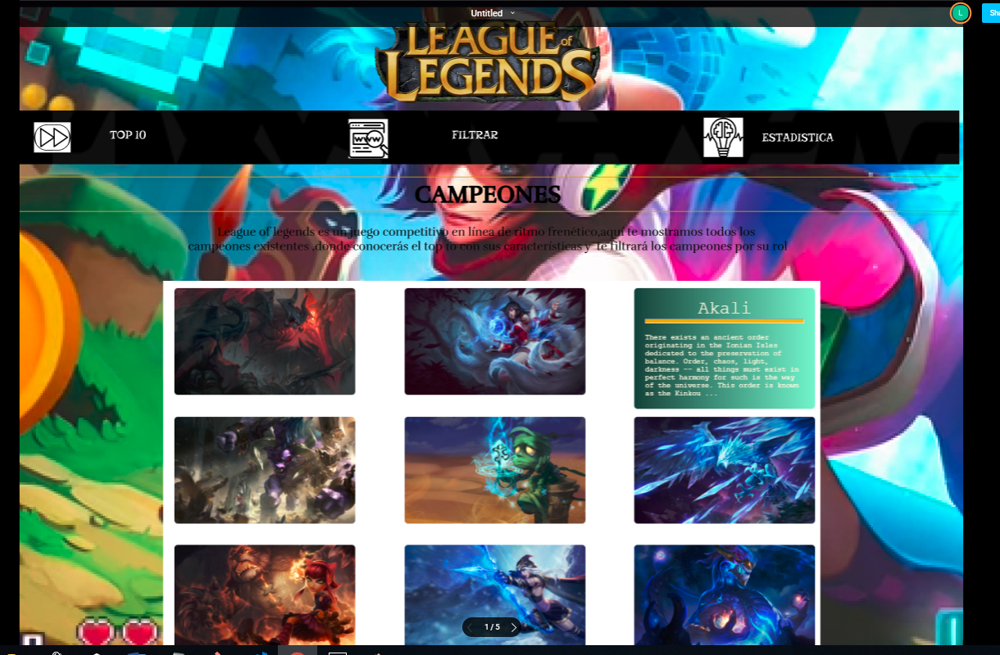
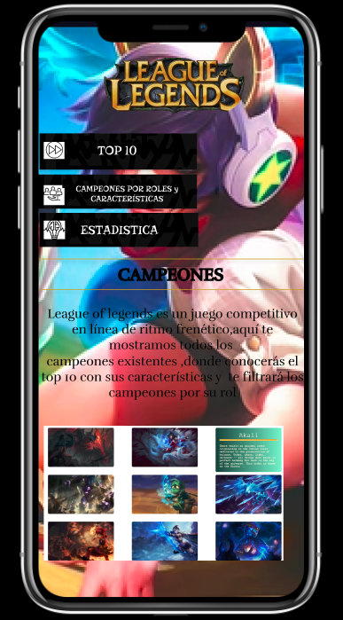

# Data Lovers
* [Definición del producto](#Definición-del-producto)
* [Entrevistas Grupales](#Entrevistas-Grupales)
* [Entrevistas Personales](#Entrevistas-Personales)
* [Historias De Usuario](#Historias-De-Usuario)
* [Conclusiones](#Conclusiones)
* [Prototipo de Baja Fidelidad](#Prototipo-de-Baja-Fidelidad)
* [Prototipo de Alta Fidelidad](#Prototipo-de-Alta-Fidelidad)

***
# Definición del producto
***
este proyecto se trata de crear una página amigable donde facilite al usuario que juega league of legends en poder encontrar y elegir sus mejores campeones según su preferencia, para ello hemos entrevistado aproximadamente a 10 usuarios,donde la mayoria ha coincidido con algunos puntos y lo hemos considerado en nuestra pagina.

* ¿Quiénes son los principales usuarios de producto?
  Los principales usuarios son aquellxs personas que utilizan el videojuego league of legends
* ¿Cuáles son los objetivos de estos usuarios en relación con el producto?
  El objetivo es que los usuarios puedan encontrar a sus campeones indicados para comenzar el juego de la manera mas facil segun su preferencia.
* ¿Cuáles son los datos más relevantes que quieren ver en la interfaz y por qué?
  Según los usuarios entrevistados nos indicaron que prefieren escoger a sus campeones según sus roles ya que les ayuda saber en que posición jugarán,
  tambien les interesaba saber sus características como su ataque,defensa,dificultad y magia poque les ayudaría escoger que mejor campeón seria mas fuerte 
  que el otro una vez que haya escogido su rol.

# Entrevistas Grupales
***
1¿Qué campeones utilizas más y por qué?
* Soy mas de rol supp utilidad,Gangplank, por Tobias Fate, es mi ídolo
* Akali, Kassadin y Shaco porque me gusta el estilo de "asesinato" que ejecuta cada uno.
* Kai-sa, jhin, sivir porque soy main adc
* Vayne, por ser "tiradora" rápida A
* ahora solo uso a magos como lulu y me encanta su forma de juego e salvado vidas 
* Ezreal, es mi campeon favorito por sus habilidades y frases
* En general uso a todos porque no tengo tiempo para andar con uno solo, me aburre
Aurelion Sol porque es dificil

2¿Que características son mas importantes para ti al escoger a un campeón? (AD, AP, Tank, Dificultad)
* AD
* Ap
* Que tanto se ajusta a mi playstyle usual (asesino) y si es AD o AP
* Pues depende tu rol, ad porque eres el hipercarry, tank para defender tu adc, y mago que es     un carry pero con cds.
* La dificultad
* Yo escojo dependiendo de la linea y composición del equipo, si hay un top AD yo voy mago AP (Si voy mid)
* Ataque (AD)
* AD y Tank
* si tuviera que elegir seria dependiendo de la linea, aveces uno tiene que elegir tanques en top, magos (ap) o asesinos (ad), tiradores (ad pero usa armas de distancia) y soporte (da curaciones o tiene un buen protagonizmo al tener control de masas)
* Tank
* AP
* Ataque, defensa y magia
* Que sea fácil de usar y que tenga mucho daño
* Estadística de dificultad
* Ad y Ap por que a mi me gusta reventar personas como con veigar de una R explatas al creido     del otro team.
* La dificultad
* Ad, tank
3 En la selección de campeón de una partida, los campeones son ordenados alfabéticamente (A-Z) ¿Que otro modo sugieres que se ordenaran los campeones en la selección? (por rol o linea, maestría, runas u otro)
* Rol
*Linea
* Por linea y maestria
* Ya se ordenan por preferencia, nombre y maestría
* Siempre los ordeno por rol, aunque no depende de eso, si sabes con un campeon y miras que te    va bien en otra linea, llevalo y ya
* por linea y rol
*por dificultad
* Por Rol estaria bien
* yo ordenaría por magos, asesinos, tiradores, tanques, soportes, soportes con control de masas, etc. pero el punto es ordenarlo sin importar que se puedan usar en otras lineas
* Por rol
* Por rol
* Por linea sería más facil
* Que se pueda personalizar, o que según tu registro de partidas, te paso nota primero lo que más usas de esa línea.
* Me gustaria que fue ordenados por maestria y se quedara fijo.

# Entrevistas Personales
 ***
1 Nombre: Jhon
Edad:23 años
Actividad:Empleador
¿qué campeón utilizas y por qué?
Jhin porque es un heroe de rango y se puede farmear(armarlo) bien.
utilizo el rol de tirado y de soporte. 
2 Nombre: Rafael
Edad:19 años
Actividad:Estudiante
¿qué campeón utilizas y por qué?
Gito Gath porque su ultimo poder es comerse a los heroes y aumenta su vida al hacerlo.
lo que mas compro en la tienda es botón de rapidez y coraza del muerto.
# Conclusiones
por las respuestas personales y grupales de los usuarios de league of legends,hemos llegado a la conclusión que la mayor parte indicaba que le gusta un campeón por el rol que asume,a la vez indica que le interesa el ataque que le caracteriza a cada rol,sus puntos de vida y algunas características de cada uno como su magia ,dificultad,etc.

# Historias De Usuario
***
 1. yo como usuario quiero quiero que me muestre los 10 primeros mejores campeones que tengan mayor rango de ataque.
 2. yo como usuario quiero que me filtre los campeones sugún el rol que elija.
 3. yo como usuario quiero que me filtre las características (ataque,defensa,dificultad y magia) de los campeones según mi elección.
 para ello hemos realizado un sketch de baja fidelidad de como quedaría y que se necesita para lograrlo.
 # Prototipo de Baja Fidelidad
 ***
 * pantalla principal
 
 me muestra la lista de los campeones de manera ordenada alfabeticamente
 
 
 * primera historia de usuario
 al hacer click en el top 10 me muestra los 10 mejores campeones según su ataque de manera descendente.
 

 * segunda historia de usuario
 al hacer click en el botón filtrar me muestra dos botones,si hago click en el lado izquierdo me mostrará una lista de roles y al escoger uno de los roles me filtrará  todos los campeones que sean de ese rol  .
 

 * tercera historia de usuario
 al hacer click en el botón derecho me mostrará una lista de todos los nombres de los campeones y al escoger uno,aparecerá su imagen y a la espalda su información.
 
 

 * cuarta historia de usuario
 al hacer click en estadística me mostrará una lista de los campeones con su hp y armadura me indica cuanto tendrían si pasaran para cada nivel.
 
 

 
 ## Prototipo de Alta Fidelidad
 ***
 * realizamos un prototipo con ayuda de FIGMA de cómo quedaría nuestro proyecto 
 
 * primer prototipo
  
 
 
 * segundo prototipo después de testear con un usuario 
 E l usuario nos indicaba que los botones principales vayan de manera lineal,porque al momento de mostrar las imagenes de los campeones no se visualizaba bien con la posición anterior.
 
  

 * Aquí se muestra como quedaría nuestra página en desktop
 
 [prototipo-en-zeplin](https://app.zeplin.io/project/5c312ecbbae2c22086d6bdbb)
 
 [prototipo-en-figma](https://www.figma.com/proto/FhGoRtLdYJ8nH1sfVmZoTTRs/Untitled?node-id=3%3A22&scaling=min-zoom)

* Aquí se muestra como quedaría nuestra página en un celular

  

  [prototipo-en-figma](https://www.figma.com/proto/eyJVJ0RkxElf4v6qa9WanbpZ/Untitled?node-id=0%3A1&scaling=scale-down)